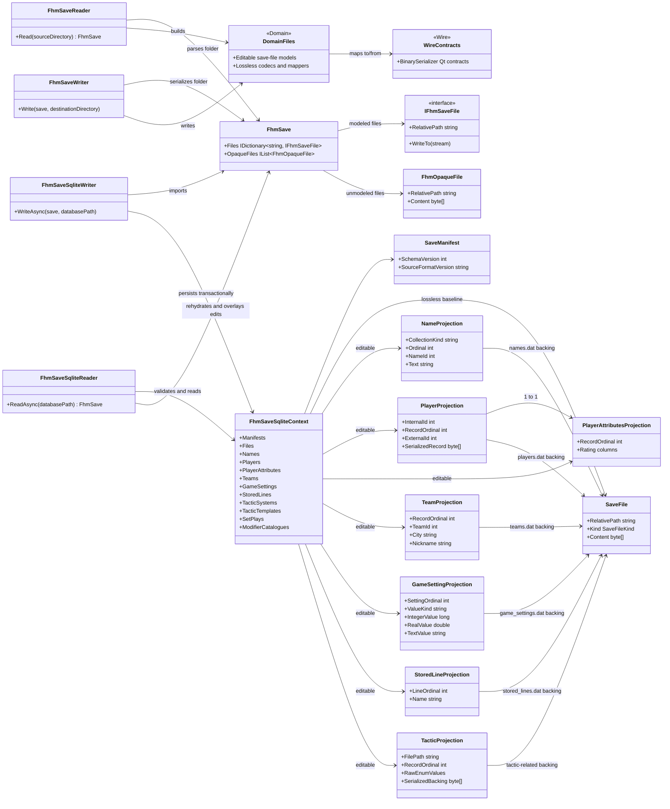

# FHM 10 save-folder SQLite format

`Shuttle.Fhm.Serde.Sqlite` is a portable local editing boundary for an FHM
10 folder. It is not the production SHL analytics database. The adapter applies
its EF Core migrations whenever it opens a database; the singleton
`SaveManifest` identifies the save-format schema version.

The save reader, writer, files, and editable models are
`Shuttle.Fhm.Serde.Domain.*`. Domain maps to the
`Shuttle.Fhm.Serde.Wire.*` BinarySerializer Qt contracts; Wire has no Domain
dependency.

## Contract

Import stores one `SaveFiles` baseline row per normalized source path. The row
contains its exact bytes and whether the source was a documented or opaque
file. Unedited export returns documented baseline files as raw byte containers
and restores opaque files directly; therefore a save-folder → SQLite →
save-folder conversion is byte-equivalent.

Projection edits are update-only. Export compares source key and ordinal sets
with the parsed baseline and rejects inserts, deletes, reorders, identity
changes, invalid dates/ratings/settings, invalid references, or malformed
fixed-size payloads. The check applies equally to EF Core and direct-SQL
edits. A rejected export returns no `FhmSave` for writing.

The editable boundary includes names; player profiles, positions, and rating
vectors; team profiles and embedded tactical settings; game settings; stored
lines; tactic systems/templates; set plays; tactics; and the supported
modifier catalogues. Fields outside those projections, all opaque files, and
the player serialized-record backing remain baseline-preserved.

## Component and projection diagram



## Usage

```csharp
var source = new FhmSaveReader().Read(@"C:\saves\Example.lg");
await new FhmSaveSqliteWriter().WriteAsync(source, @"C:\work\example.sqlite");

await using var db = new FhmSaveSqliteContext(
    FhmSaveSqliteContext.CreateOptions(@"C:\work\example.sqlite"));
db.Players.Single(player => player.RecordOrdinal == 0).ExternalId = 12345;
await db.SaveChangesAsync();

var save = await new FhmSaveSqliteReader().ReadAsync(@"C:\work\example.sqlite");
new FhmSaveWriter().Write(save, @"C:\saves\Example-copy.lg");
```

The adapter never needs a temporary folder to parse baseline blobs: it uses
the Domain assembly's shared in-memory codec seam.
