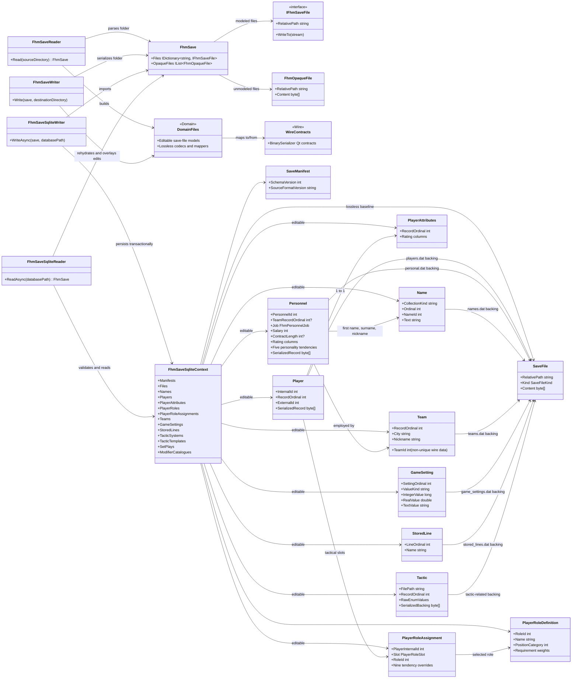

# FHM 10 save-folder SQLite format

`Shuttle.Fhm.Serde.Sqlite` is a portable local editing boundary for an FHM
10 folder. It is not the production SHL analytics database. The adapter applies
its EF Core migrations whenever it opens a database; the singleton
`SaveManifest` identifies the save-format schema version.

The save reader, writer, files, and editable models are
`Shuttle.Fhm.Serde.Domain.*`. Domain maps to the
`Shuttle.Fhm.Serde.Wire.*` BinarySerializer Qt contracts; Wire has no Domain
dependency.

## Contract

Import stores one `SaveFiles` baseline row per normalized source path, except
for the top-level `graphics/`, `import_export/`, and `rs*/` auxiliary trees.
The row contains its exact bytes and whether the source was a documented or
opaque file. Unedited export returns documented baseline files as raw byte
containers and restores opaque files directly; therefore a save-folder →
SQLite → save-folder conversion is byte-equivalent for the included save-data
boundary.

Entity edits are update-only. Export compares source key and ordinal sets
with the parsed baseline and rejects inserts, deletes, reorders, identity
changes, invalid dates/ratings/settings, invalid references, or malformed
fixed-size payloads. The check applies equally to EF Core and direct-SQL
edits. A rejected export returns no `FhmSave` for writing.

The editable boundary includes names; player profiles, positions, contracts,
contract roles, tactical-role assignments, tactical-role definitions, and
rating vectors; personnel jobs, ratings, employment, and contracts; team
profiles, staff relationships, active lineups, and embedded tactical settings; game settings;
stored lines; tactic systems/templates; set plays; tactics; and the supported
modifier catalogues. Unknown fields, opaque files, and serialized-record
backing remain baseline-preserved.

`Personnel.TeamRecordOrdinal` resolves the `personal.dat` team record index to
the `Teams.RecordOrdinal` primary key. `Team.Staff`, `Team.GeneralManager`, and `Team.HeadCoach`
expose employment relationships; export synchronizes the explicit GM and head
coach personnel slots in `teams.dat`.

`TeamActiveLineSlots` normalizes the thirteen `teams.dat` active-line groups by
team record ordinal, `FhmLineGroup`, and slot ordinal. Each populated slot references
`Players.InternalId`; an empty slot is stored as null. These are the team's
current game lines and are distinct from user-named `stored_lines.dat` records.

The player team reference is also normalized: `players.dat` stores the team's
record index, while `Players.TeamRecordOrdinal` stores the corresponding
`Teams.RecordOrdinal`. The decoded wire `Teams.TeamId` is retained as a
non-unique data field. Import
and export translate between those two identity spaces.

Player roles are represented as three distinct systems:

- `Players.PrimaryContractRole` is the `FhmPlayingRole` contract archetype.
- `Players.SupplementaryContractRole` is the `FhmSquadStatus` contract status.
- `TacticalRoles` is the data-driven tactical-role catalogue from
  `player_roles.dat`. `PlayerTacticalRoleAssignments` links a player and tactical or
  secondary-tactical slot to one catalogue entry, and
  `PlayerTacticalRoleTendencyValues` stores all nine per-assignment override
  flag/value pairs.

The tactical catalogue's fixed requirement vectors are normalized in
`TacticalRoleWeights`; its four variable index lists are normalized in
`TacticalRoleIndexEntries`. Export requires each fixed vector to retain its
defined length, each vector/list to have contiguous ordinals, and every
tactical assignment to contain exactly the nine known tendency rows.

## Component and projection diagram



## Usage

```csharp
var source = new FhmSaveReader().Read(@"C:\saves\Example.lg");
await new FhmSaveSqliteWriter().WriteAsync(source, @"C:\work\example.sqlite");

await using var db = new FhmSaveSqliteContext(
    FhmSaveSqliteContext.CreateOptions(@"C:\work\example.sqlite"));
db.Players.Single(player => player.RecordOrdinal == 0).ExternalId = 12345;
await db.SaveChangesAsync();

var save = await new FhmSaveSqliteReader().ReadAsync(@"C:\work\example.sqlite");
new FhmSaveWriter().Write(save, @"C:\saves\Example-copy.lg");
```

The adapter never needs a temporary folder to parse baseline blobs: it uses
the Domain assembly's shared in-memory codec seam.
